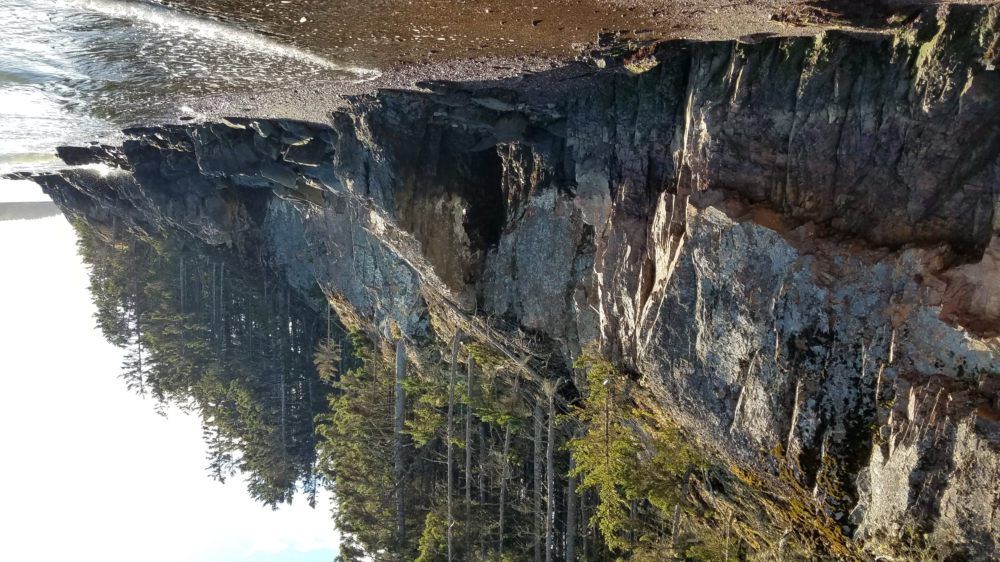

#### Schoodic Peninsula: The Uncrowded Alternative to Mount Desert Island 

Schoodic features a one-way road through an incredible seaside forest, mountain biking trails, and amazing views. A nice option is to park at the *Pickeled Wrinkle* in Birch Harbor, ride the 15-mile Schoodic Loop through the park, and end back at the *Wrinkle* for a cold beer and some good pub food.
 